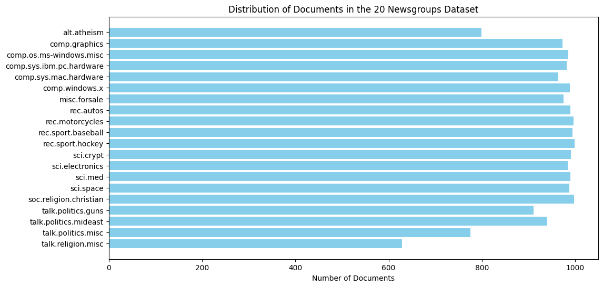
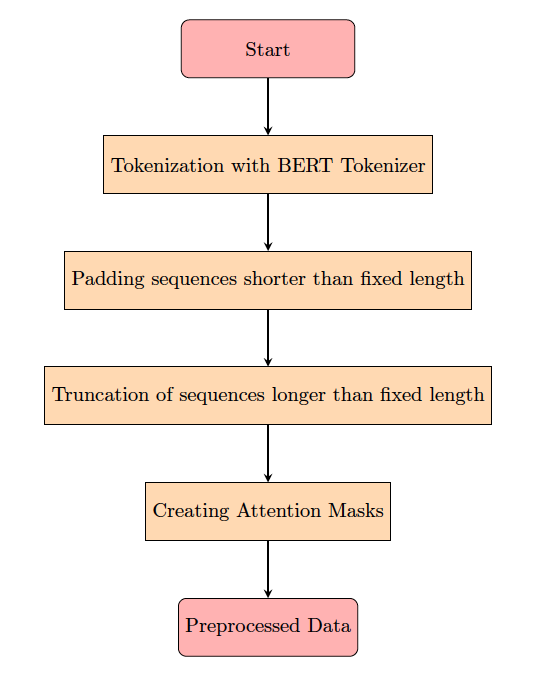
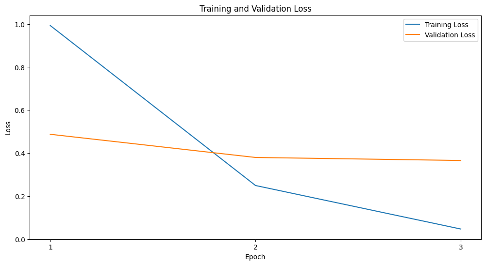
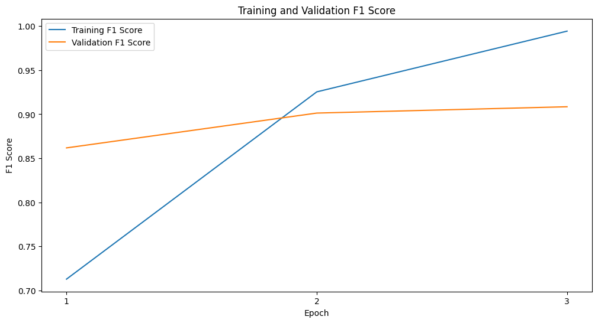

# News Group Text Classification with BERT

## Table of Contents
1. [Introduction](#introduction)
2. [Dataset](#dataset)
3. [Preprocessing](#preprocessing)
4. [Model Implementation](#model-implementation)
5. [Training](#training)
6. [Evaluation](#evaluation)
7. [Benchmark Comparison](#benchmark-comparison)
8. [Conclusion](#conclusion)
9. [References](#references)

## Introduction
This project details the implementation and fine-tuning of a transformer model for multi-class text classification using the 20 Newsgroups dataset. BERT (Bidirectional Encoder Representations from Transformers) was chosen due to its state-of-the-art performance across various natural language processing tasks. The project follows a structured approach involving data preprocessing, model implementation, training, and evaluation. The primary objective is to achieve robust performance on the test set and compare the results with established benchmarks.

## Dataset
The 20 Newsgroups dataset contains approximately 20,000 newsgroup documents, partitioned across 20 different newsgroups. This dataset is widely used for text classification tasks and provides a balanced distribution of documents across various categories. As shown in Figure 1, the classes are fairly balanced.

*Figure 1: Distribution of Documents in the 20 Newsgroups Dataset*

## Preprocessing
Preprocessing is a crucial step in preparing the text data for fine-tuning the BERT model because BERT expects inputs in a specific format. Conventional steps such as stopwords removal and lowercasing were not performed because BERT handles this internally and English language stopwords are needed for its contextual understanding. The following steps were performed:

### Tokenization
The text data was tokenized using the BERT tokenizer, which converts the text into tokens that the BERT model can understand. BERT uses WordPiece tokenization to handle unknown words effectively. This tokenizer also adds special tokens such as [CLS] at the beginning and [SEP] at the end of each sentence. While BERT can handle sequences up to a maximum length of 512 tokens, it requires all input sequences to be of a fixed length for efficient batch processing.

### Padding and Truncation
Since BERT requires all input sequences to be of the same fixed length, sequences shorter than this length are padded with additional '0' tokens. Padding ensures that all sequences have the same length, allowing for efficient batch processing. Conversely, sequences longer than the fixed length are truncated, meaning tokens beyond this length are removed. This truncation ensures that the input sequences fit within the maximum length requirement of BERT.

### Attention Masks
Attention masks are created to differentiate between real tokens and padding tokens. An attention mask is a binary vector that indicates which tokens are actual words and which are padding. A mask value of '1' represents real tokens, while a mask value of '0' represents padding tokens. This is necessary because BERT needs to know which parts of the input are actual data and which parts are just padding.

*Figure 2: Flowchart of the Preprocessing Steps*

## Model Implementation
A pre-trained BERT model was used for this task, specifically the `bert-base-uncased` variant. This variant was chosen because it balances efficiency and performance, containing fewer parameters compared to the larger BERT model, which makes it faster and less resource-intensive while still achieving high accuracy. The "uncased" version was selected as it treats uppercase and lowercase letters as equivalent, which is often beneficial for tasks where capitalization does not alter the meaning of the words. The model was fine-tuned for the multi-class classification task using the preprocessed data. BERT's self-attention mechanism allows the model to focus on different parts of the input sequence, which is beneficial for understanding the context and relationships within the text, thereby improving the classification accuracy.

## Training
The model was trained for three epochs. This choice is supported by literature, as Devlin et al. (2019) recommend between one and five epochs for fine-tuning BERT. The training process included periodic saving of the model weights to ensure the best performance on the validation set. The training and validation curves (Figures 3, 4, and 5) demonstrate the model's performance over the epochs. It might be beneficial to train the model over two epochs instead, as the model began to overfit from the third epoch as evidenced by the validation and training curves.

*Figure 3: Training and Validation Loss*

*Figure 4: Training and Validation F1 Score*

*Figure 5: Training and Validation Accuracy*

## Evaluation
The model's performance was evaluated on a held-out test set. The results are reported using metrics such as accuracy and F1 score, which provides a balance between precision and recall, giving an overall measure of the model's performance in predicting each class. The F1 score is particularly useful for multi-class classification tasks as it provides a single metric that reflects the performance across all classes.

| Metric    | Training | Validation | Test |
|-----------|-----------|------------|------|
| Loss      | 0.474     | 0.587      | 0.588|
| F1 Score  | 1.000     | 0.908      | 0.843|
| Accuracy  | 1.000     | 0.905      | 0.845|

*Table 1: Model Performance Metrics*

## Benchmark Comparison
The results of the fine-tuned BERT model were compared to established benchmarks. The model achieved a test accuracy of 84.55% and a test F1 score of 84.30%. Compared to the benchmark results of RoBERTaGCN achieving an accuracy of 89.5%, the BERT model's performance is reasonable, though there is room for improvement. The benchmarks demonstrate the effectiveness of more advanced models like RoBERTaGCN, but the fine-tuned BERT model still provides competitive results given the constraints of training time and computational resources.

## Conclusion
The transformer model was successfully implemented and fine-tuned for multi-class text classification using the 20 Newsgroups dataset. The model achieved a reasonable performance on the test set, with a test accuracy of 84.55% and a test F1 score of 84.30%. The self-attention mechanism in BERT proved to be beneficial for understanding the context within the text data.

## References
- Devlin, J., Chang, M.-W., Lee, K., & Toutanova, K. (2019). BERT: Pre-training of Deep Bidirectional Transformers for Language Understanding. In J. Burstein, C. Doran, & T. Solorio (Eds.), Proceedings of the 2019 Conference of the North American Chapter of the Association for Computational Linguistics: Human Language Technologies, Volume 1 (Long and Short Papers) (pp. 4171–4186). Association for Computational Linguistics. [https://doi.org/10.18653/v1/N19-1423](https://doi.org/10.18653/v1/N19-1423)
